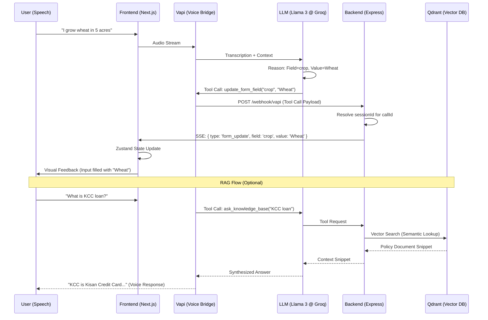

# Sahayak — Multilingual Voice-to-Form AI Engine

**Sahayak** (meaning *Helper*) is a professional, industrial-grade voice portal designed to bridge the digital divide for rural populations. Powered by **VaaniPay**, this system converts spoken vernacular into structured English data in real-time, enabling low-literacy users to fill out complex government subsidy and microfinance application forms with ease.

---

## 🚀 Key Features

- **🌐 Multilingual Regional Voice Support**: Speak in Hindi, Kannada, Tamil, or Telugu. The system detects the language and responds naturally in vernacular.
- **📊 Real-Time English Registry**: Regardless of the spoken language, data is extracted and recorded in standardized English in the portal registry.
- **⚡ Lazy Audio Initialization**: Complies with high-security browser policies by deferring audio context creation until explicitly requested by the user.
- **📡 Live Form Synchronization**: Powered by Server-Sent Events (SSE) and Vapi Webhooks for zero-latency UI updates during a conversation.
- **🧠 Intelligent Knowledge Access**: Integrated RAG (Retrieval-Augmented Generation) allows users to ask about complex terms (e.g., "What is Kollateral?") mid-form.

---

## 🛠 Tech Stack

### Frontend (User Interface)
- **Framework**: [Next.js 16](https://nextjs.org/) (App Router & Turbopack)
- **Library**: [React 19](https://react.dev/) with Tailwind CSS 4
- **State Management**: [Zustand](https://github.com/pmndrs/zustand) for high-performance state management
- **Voice SDK**: [Vapi Web SDK](https://vapi.ai/) for low-latency voice streaming
- **Communication**: [EventSource (SSE)](https://developer.mozilla.org/en-US/docs/Web/API/Server-sent_events) for receiving live updates from the backend.

### Backend (Orchestration & Logic)
- **Runtime**: [Node.js](https://nodejs.org/) & [Express](https://expressjs.com/) (TypeScript)
- **Intelligence**: [Groq](https://groq.com/) & [Llama 3](https://ai.meta.com/blog/meta-llama-3/) (70B) for ultra-fast LLM reasoning
- **Vector Database**: [Qdrant](https://qdrant.tech/) (Cloud/Local) for glossary and user memory retrieval
- **Embeddings**: [Transformers.js](https://huggingface.co/docs/transformers.js/) (`all-MiniLM-L6-v2`) for local CPU embedding generation
- **Voice Synthesis**: [ElevenLabs](https://elevenlabs.io/) for human-like empathetic regional speech

---

## 🏗 System Architecture & Methodology

Sahayak operates as a **tri-synchronous ecosystem**, where the voice AI, the logic server, and the user interface communicate in real-time.

### 1. The Voice Bridge (STT & LLM)
- **Vernacular Input**: The user speaks in a regional dialect.
- **Streaming STT**: Vapi streams audio to high-accuracy STT models.
- **Intent Extraction**: The Llama 3 model (via Groq) is configured with a specific System Prompt defining form schemas and real-time tool calls for data extraction.

### 2. The Logic Backend (Orchestration)
- **Webhook Processing**: An Express server validates incoming `tool-calls` (e.g., `update_form_field`) from Vapi.
- **Identity Linkage**: The backend maps the Vapi `callId` to the frontend's `sessionId`, ensuring data is routed to the correct browser instance.
- **SSE Dispatch**: The backend sends a Server-Sent Event (SSE) to the connected client for zero-latency UI updates.

### 3. The Visual Registry (UI)
- **State Update**: The React frontend listens to the SSE stream and updates the **Zustand store** upon receiving patches.
- **Real-Time Render**: Components automatically re-render, showing visual feedback of the active registry being filled.

---

## 📊 Data Flow Diagram



---

## 🧠 Implementation Deep-Dive

### Identity Linkage (The "Session Bridge")
To ensure data from Call A only updates Browser Tab A, Sahayak:
- Injects a `sessionId` into Vapi `callMetadata` during initialization.
- Maintains a `callIdToSessionId` map in the backend to bridge webhook triggers.
- Uses a persistent registry of SSE connections mapped by `sessionId`.

### Lazy Audio Initialization
To comply with the **Autoplay Policy** (common in Chrome/Safari), Sahayak uses a state-driven "Start Session" button. The `AudioContext` is only created upon user gesture, preventing `NotAllowedError`.

### Multi-Regional RAG
The `ask_knowledge_base` tool allows the AI to stay accurate without massive context windows:
- **Documents**: FAQs about subsidies, dictionary of regional agricultural terms.
- **Flow**: User Question → Vector Search → Context Injection → LLM Response.

### Form Logic & Non-Linear Flow
The system supports **Skipping Logic**. For example, if `hasBusiness` is `false`, the backend notifies the frontend to hide unrelated business fields through the SSE stream automatically.

---

## 💰 Free-Tier Optimization (Sovereign AI)

Unlike many voice portals, Sahayak is optimized to run on **zero-cost infrastructure**:
- **Local Embeddings**: Uses **Transformers.js** entirely on your local CPU. No OpenAI credits required for RAG.
- **Groq LLM**: Configured to use the Groq Llama 3 free tier for ultra-low latency.
- **Docker-Ready**: Integrated `docker-compose.yml` for instant persistent vector memory with Qdrant.

---

## 📦 Installation & Setup

### Prerequisites
- Node.js (v20+)
- Vapi account ([vapi.ai](https://vapi.ai))
- Groq account ([console.groq.com](https://console.groq.com))
- Docker (optional, for local Qdrant)

### 1. Repository Setup
```bash
git clone https://github.com/siri-sanjana/hackblr.git
cd hackblr
```

### 2. Backend Startup
```bash
cd backend
npm install
# Configure .env with your VAPI_API_KEY and GROQ_API_KEY
npm run seed  # Seed local glossary vectors
npm run dev
```

### 3. Frontend Startup
```bash
cd frontend
npm install
# Configure .env.local with NEXT_PUBLIC_VAPI_PUBLIC_KEY
npm run dev
```

### 4. Public Tunneling (Webhooks)
For external voice communication to reach your local backend:
```bash
ngrok http 4000
```
Update your Vapi agent's **Server URL** with the resulting ngrok address.

---


## 🤝 Contributing
This project is part of a social impact initiative to improve digital accessibility in rural India. Contributions are welcome.

## 📄 License
This project is licensed under the MIT License - see the [LICENSE](LICENSE) file for details.
