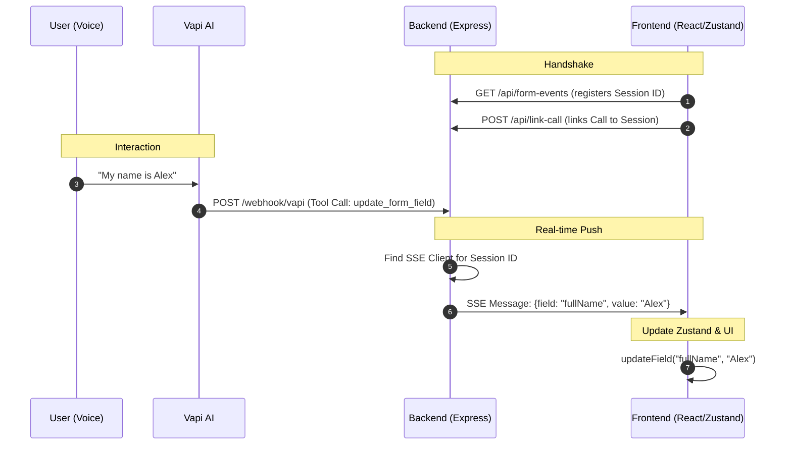

# Live Form Update Architecture

This document explains how the real-time form updates are implemented in the HackBLR application, bridging the gap between voice interaction and the user interface.

## Overview

The live update system allows the **Vapi Voice Assistant** to fill out form fields in the browser as the user speaks. This is achieved through a combination of **Server-Sent Events (SSE)**, **Webhooks**, and **Zustand State Management**.

---

## 1. Technical Components

### A. Server-Sent Events (SSE)
Instead of the frontend constantly polling the backend for updates, we use SSE. This creates a one-way, persistent pipe from the server to the browser.

- **Endpoint:** `GET /api/form-events?sessionId=xxx`
- **Purpose:** Allows the backend to "push" data to a specific browser session instantly.

### B. The Session Registry
Because multiple users might be using the app simultaneously, the backend maintains a mapping of active connections.
- **Registry:** A global `Map<string, Response>` in the backend called `sseClients`.
- **Linking:** The frontend calls `/api/link-call` to associate a Vapi `callId` with the browser's `sessionId`.

### C. Vapi Tool Calls
Vapi is configured with a tool named `update_form_field`. When the AI extracts a value (like a name or age), it triggers this tool.

---

## 2. The End-to-End Flow

### Phase 1: Initialization
1. The **Frontend** generates a unique `sessionId`.
2. The **Frontend** opens an SSE connection using the `useSSEFormUpdates` hook.
3. The **Backend** stores this connection in the `sseClients` map.

### Phase 2: The Voice Interaction
1. The user starts a call.
2. The AI (Vapi) hears the user provide information (e.g., *"My name is Alex"*).
3. Vapi triggers the `update_form_field` tool.

### Phase 3: The Data Pipeline
1. **Webhook:** Vapi sends a POST request to `backend/src/routes/vapi.ts`.
2. **Identification:** The backend identifies the `sessionId` for the incoming `callId`.
3. **Dispatch:** The backend finds the corresponding SSE connection in its map and writes a JSON packet:
   ```json
   { "type": "form_update", "field": "fullName", "value": "Alex" }
   ```

### Phase 4: UI Synchronization
1. **Reception:** The `useSSEFormUpdates` hook in the frontend receives the message.
2. **State Update:** It calls `store.updateField(field, value)` in the Zustand store.
3. **Re-render:** React detects the state change in the `form` object and updates the specific input field on the screen immediately.

---

## 3. Visual Flow Diagram



---

## 4. Key Code References

### Backend Logic
The core routing and SSE dispatching happen in `backend/src/routes/vapi.ts`.
- [SSE Client Registry](file:///Users/sirisanjana/Downloads/hackblr_go%202/hackblr/backend/src/routes/vapi.ts#L8)
- [Webhook Processing](file:///Users/sirisanjana/Downloads/hackblr_go%202/hackblr/backend/src/routes/vapi.ts#L90)
- [SSE Dispatcher](file:///Users/sirisanjana/Downloads/hackblr_go%202/hackblr/backend/src/routes/vapi.ts#L207-L220)

### Frontend Logic
The listener and state integration happen in the hooks and store.
- [SSE Event Listener](file:///Users/sirisanjana/Downloads/hackblr_go%202/hackblr/frontend/hooks/useSSEFormUpdates.ts#L67-L96)
- [Zustand State Update](file:///Users/sirisanjana/Downloads/hackblr_go%202/hackblr/frontend/lib/formStore.ts#L65-L70)
